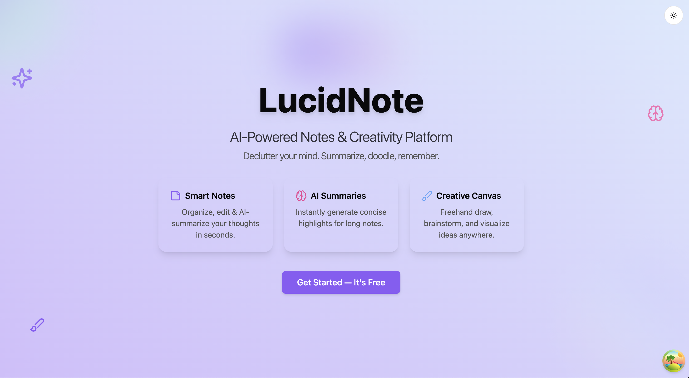

# LucidNote - Smart Note-Taking with AI Summaries



LucidNote is a modern note-taking application that combines rich text editing with AI-powered summarization capabilities. It helps users organize thoughts, create summaries, and collaborate visually through an interactive canvas.

## ✨ Features

### 📝 Smart Notes
- Create, edit, and organize notes in a clean, modern interface
- Rich text editing capabilities
- Tag and categorize notes for better organization

### 🧠 AI Summarization
- Automatically generate concise summaries of your notes using Google's Gemini AI
- Toggle between full notes and summaries with a single click
- Save time by getting key points instantly

### 🎨 Ideation Canvas
- Visual brainstorming tool for creativity and planning
- Create sticky notes, shapes, and text elements
- Draw freehand to sketch ideas
- Move and organize elements freely
- No database persistence - perfect for quick ideation sessions

### 👤 User Authentication
- Secure authentication with email/password
- Google OAuth integration for quick sign-in
- Profile management

## 🚀 Tech Stack

- **Frontend Framework**: React with TypeScript
- **Styling**: Tailwind CSS with shadcn/ui components
- **State Management**: React Query for server state, React context for client state
- **Authentication**: Supabase Auth
- **Database**: Supabase PostgreSQL
- **AI Integration**: Google Gemini API
- **Routing**: React Router
- **Hosting**: Vercel/Netlify

## 📋 Getting Started

### Prerequisites

- Node.js 16.x or later
- npm or bun package manager
- Supabase account (for auth and database)
- Google Gemini API key (for AI summarization)

### Installation

1. Clone the repository:
   ```bash
   git clone https://github.com/yourusername/lucid-note.git
   cd lucid-note
   ```

2. Install dependencies:
   ```bash
   npm install
   # or
   bun install
   ```

3. Create a `.env` file in the root directory:
   ```env
   VITE_SUPABASE_URL=your_supabase_url
   VITE_SUPABASE_ANON_KEY=your_supabase_anon_key
   VITE_GEMINI_API_KEY=your_gemini_api_key
   ```

4. Start the development server:
   ```bash
   npm run dev
   # or
   bun dev
   ```

5. Open your browser and navigate to `http://localhost:5173`

## 🛠️ Development

### Project Structure

```
lucid-note/
├── public/                # Static assets
├── src/
│   ├── components/        # Reusable components
│   │   ├── auth/          # Authentication components
│   │   ├── canvas/        # Canvas components
│   │   ├── layout/        # Layout components
│   │   └── ui/            # shadcn/ui components
│   ├── hooks/             # Custom React hooks
│   ├── integrations/      # Third-party integrations
│   │   └── supabase/      # Supabase client
│   ├── lib/               # Utilities and helpers
│   ├── pages/             # Page components
│   └── App.tsx            # Main application component
└── README.md              # Project documentation
```

### Building for Production

```bash
npm run build
# or
bun run build
```

## 📱 Usage

### Notes

1. Navigate to the Dashboard
2. Click "New Note" to create a note
3. Edit note content as needed
4. Click "Summarize" to generate an AI summary
5. Toggle between summary and full content

### Canvas

1. Navigate to the Canvas page
2. Use the toolbar to select a tool:
   - Sticky note: Add draggable notes
   - Rectangle/Circle: Add shapes
   - Text: Add text elements
   - Pen: Draw freehand
   - Move: Reposition elements
   - Eraser: Delete elements
3. Use color picker to change element colors
4. Drag and arrange elements as needed

## 📄 License

This project is licensed under the MIT License - see the [LICENSE](LICENSE) file for details.

## 🤝 Contributing

Contributions are welcome! Please feel free to submit a Pull Request.

1. Fork the repository
2. Create your feature branch (`git checkout -b feature/amazing-feature`)
3. Commit your changes (`git commit -m 'Add some amazing feature'`)
4. Push to the branch (`git push origin feature/amazing-feature`)
5. Open a Pull Request

## 🙏 Acknowledgements

- [shadcn/ui](https://ui.shadcn.com/) for the beautiful UI components
- [Lucide Icons](https://lucide.dev/) for the icon set
- [Tailwind CSS](https://tailwindcss.com/) for the styling framework
- [React Query](https://tanstack.com/query/latest) for data fetching and caching
- [Google Gemini](https://ai.google.dev/) for the AI summarization capabilities
- [Supabase](https://supabase.com/) for auth and database services